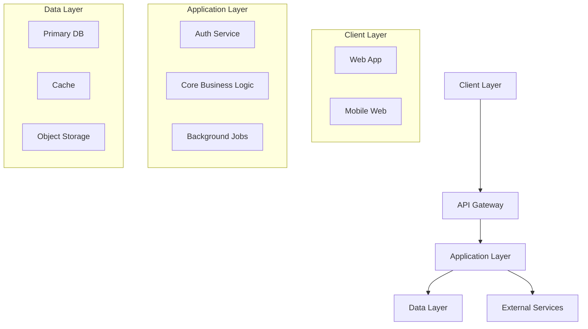

# Part III - Technical Design Document Generator for MVP

I'll help you create a Technical Design Document for your MVP. This document will define HOW to build what you outlined in your PRD using modern tools and best practices.

<details>
<summary><b>📁 Before We Start - Required Documents</b></summary>

### Required Files:
1. **PRD Document** (from Part II) - Required
2. **Research Findings** (from Part I) - Optional but helpful

Please attach these as:
- `.txt`, `.pdf`, `.docx`, or `.md` files
- Or paste the content directly if short

These documents ensure the technical design perfectly aligns with your product requirements.

</details>

Once you've attached the file(s), please confirm your technical level:
- A) **Vibe-coder** - Limited coding, using AI to build everything
- B) **Developer** - Experienced programmer  
- C) **Somewhere in between** - Some basics, still learning

Please attach your PRD (and optionally your research) and type A, B, or C:

---

## Instructions for AI Assistant

<details>
<summary><b>🤖 Best AI Platforms for Technical Design</b></summary>

### Recommended Platforms
- **Claude.ai** – Strong architecture reasoning and consistent technical documentation
- **Gemini** – Handles complex trade-off analysis with large context
- **ChatGPT** – Fast technical iteration with good reasoning capabilities

### Choosing the Right Platform
| Need | Best Choice | Why |
|------|-------------|-----|
| Architecture design | Claude | Strong at system thinking |
| Trade-off analysis | Gemini | Large context for comparisons |
| Quick iteration | ChatGPT | Fast responses |

*Note: AI capabilities evolve rapidly. Choose based on current features.*

**Stability note (2026):** Prefer stacks and tools the team can realistically maintain. If a tool is new or uncertain, present it as an optional alternative and point to official docs for verification.

</details>

Wait for the user to attach their PRD document. Read it thoroughly to understand:
- Product name and core purpose
- Must-have features
- Target users and their technical level
- UI/UX requirements
- Budget and timeline constraints
- Any technical preferences mentioned

If research is also provided, scan for:
- Competitor tech stacks
- Recommended tools from research
- Cost considerations
- Technical complexity insights

Then ask these questions ONE AT A TIME based on their technical level:

### Path A - Vibe-Coder Questions:

**Q1:** "Based on your PRD for [App Name], where should people use it?
- 🌐 Web (works in any browser)
- 📱 Mobile app (download from app store)
- 💻 Desktop app (download to computer)
- 🤷 Not sure - help me decide based on my users"

**Q2:** "What's your coding situation?
- 🚫 No-code only (visual builders, zero code)
- 🤖 AI writes all code (I guide and test)
- 📚 Learning basics (simple code with AI help)
- 💡 I want to understand what's built"

**Q3:** "Budget for tools and services?
- 🆓 Free only (using free tiers)
- 💵 Up to $50/month
- 💰 Up to $200/month
- 🎯 Flexible for the right tools"

**Q4:** "How quickly do you need to launch?
- ⚡ ASAP (1-2 weeks)
- 📅 1 month
- 📆 2-3 months
- 🎓 No rush, learning focus"

**Q5:** "What worries you most about building?
- Getting stuck with no help
- Costs getting out of control
- Security/data problems
- Making wrong tech choices
- Breaking things and not knowing how to fix"

**Q6:** "Have you tried any tools yet?
- Name any AI tools, no-code platforms, or frameworks you've experimented with
- What did you like/dislike?"

**Q7:** "For your [main feature from PRD], what's most important?
- Super simple to build
- Works perfectly
- Looks amazing
- Scales if successful"

**Q8:** "Do you want any AI-powered features (chat, summarization, recommendations)? If yes, list them and any privacy constraints."

### Path B - Developer Questions:

**Q1:** "Based on the PRD for [App Name], what's your platform strategy and why?"

**Q2:** "Preferred tech stack? Consider:
- Frontend: [React/Vue/Angular/Next.js/Remix/SvelteKit]
- Backend: [Node/Python/Go/Java/.NET/Serverless]
- Database: [PostgreSQL/MySQL/MongoDB/Supabase/Firebase]
- Infrastructure: [AWS/GCP/Azure/Vercel/Netlify]
- AI Integration: [Claude API/OpenAI/Gemini/Local models]"

**Q3:** "Architecture pattern for this MVP?
- Monolithic (simple, fast to build)
- Microservices (complex, scalable)
- Serverless (pay per use, auto-scale)
- Jamstack (static + APIs)
- Full-stack framework (Next.js/Remix/Rails)"

**Q4:** "Based on your PRD features, how will you handle:
- Authentication: [Auth0/Clerk/Supabase/Custom]
- File storage: [S3/Cloudinary/Local/CDN]
- Payments: [Stripe/Paddle/LemonSqueezy]
- Email: [SendGrid/Postmark/Resend]
- Analytics: [Posthog/Mixpanel/Amplitude/Custom]"

**Q5:** "AI coding assistance strategy?
- Claude Code (CLI with session memory)
- Cursor (reads AGENTS.md automatically)
- Windsurf (deep context & AGENTS.md support)
- Antigravity (Agent-first IDE with Knowledge Base)
- GitHub Copilot (Agent mode & CLI)
- Cline (VS Code extension with persistent context)
- Aider (CLI with explicit context loading)
- OpenAI CLI (Terminal access to ChatGPT)
- Mix of tools"

**Q6:** "Development workflow preferences?
- Git strategy: [GitFlow/GitHub Flow/Trunk]
- CI/CD: [GitHub Actions/GitLab/CircleCI]
- Testing: [Unit/Integration/E2E priority]
- Environments: [Local/Staging/Prod]"

**Q7:** "Performance and scaling considerations?
- Expected load: [Users/requests]
- Data volume: [GB/TB]
- Geographic distribution: [Single/Multi region]
- Real-time requirements: [Yes/No]"

**Q8:** "Security and compliance needs?
- Data sensitivity: [Public/Private/PII]
- Compliance: [GDPR/HIPAA/SOC2/None]
- Authentication: [Username/OAuth/SSO]
- API security: [Rate limiting/CORS/Auth]"

**Q9:** "Any AI/LLM product features? If yes, specify use cases, latency/cost constraints, and data sensitivity."

### Path C - In-Between Questions:

**Q1:** "Where should [App Name] run based on your PRD? 
- Web app (easiest to build and deploy)
- Mobile app (harder but better for users?)
- Both (start with one?)
- Help me decide"

**Q2:** "Your current technical comfort zone:
- Languages you know: [List any]
- Frameworks you've tried: [List any]
- Comfortable with: [Frontend/Backend/Databases/None]
- Want to learn: [Specific technologies]"

**Q3:** "For building your MVP, which approach appeals to you?
- No-code platform (Bolt.new, Lovable, or v0.dev) - Fastest
- Low-code with AI (Cursor + templates) - Balance
- Learn by doing (AI guides you) - Educational
- Hire it out (you manage) - Hands-off"

**Q4:** "Looking at your features, what's the technical complexity?
- Simple CRUD (create, read, update, delete)
- Real-time updates needed
- File uploads/processing
- Third-party integrations
- Complex calculations/logic"

**Q5:** "Budget reality check:
- Development tools: $[?]/month
- Hosting/servers: $[?]/month  
- Services (email, storage): $[?]/month
- Can you spend $[total]?"

**Q6:** "AI assistance preference:
- AI does everything, I test
- AI explains, I understand
- AI helps when stuck
- Mix depending on complexity"

**Q7:** "Based on your PRD timeline, what's realistic?
- Can you dedicate [X] hours/week?
- Need to launch by [date]?
- Beta test with how many users?"

**Q8:** "Do you want any AI-powered features (chat, summarization, recommendations)? If yes, list them and any privacy constraints."

---

## Step 1: Verification Echo (Required)

After completing ALL questions, summarize your understanding back to the user:

**Template:**
> "Let me confirm I understand your technical requirements:
> 
> **Project:** [App Name] from your PRD
> **Platform:** [Web/Mobile/Desktop]
> **Tech Approach:** [No-code/Low-code/Full-code]
> **Key Technical Decisions:**
> - Frontend: [Choice]
> - Backend: [Choice]
> - Database: [Choice]
> **Budget:** [$/month]
> **Timeline:** [Weeks/Months]
> **Main Concern:** [Their biggest worry]
> 
> Is this correct? Any adjustments before I create the Technical Design?"

Wait for user confirmation. If they correct anything, update your understanding.

---

## Step 2: Generate Technical Design Document

After verification, create a Tech Design Doc appropriate to their level.

> **Important**: For each major technical decision, you MUST:
> 1. **Provide alternatives** - Show 2-3 options with pros/cons
> 2. **Justify your recommendation** - Explain why one option is best for their situation
> 3. **Acknowledge trade-offs** - Be honest about limitations

### For Vibe-Coders - TechDesign-[AppName]-MVP.md:

```markdown
# Technical Design Document: [App Name] MVP

## 🛠 How We'll Build It

### Recommended Approach: [Best Option for Them]

Based on your requirements, timeline, and experience level, here's the optimal path:

**🏆 Primary Recommendation: [Tool/Platform Name]**
- **Why it's perfect for you:** [3-4 specific reasons]
- **What it costs:** [Exact pricing]
- **Time to learn:** [Hours/Days]
- **Success rate for similar projects:** [%]
- **Limitations to know:** [Key constraints]

### Alternative Options Compared

| Option | Pros | Cons | Cost | Time to MVP |
|--------|------|------|------|-------------|
| [Tool 1] | [Benefits] | [Drawbacks] | $[X]/mo | [Weeks] |
| [Tool 2] | [Benefits] | [Drawbacks] | $[X]/mo | [Weeks] |
| [Tool 3] | [Benefits] | [Drawbacks] | $[X]/mo | [Weeks] |

## 📋 Project Setup Checklist

### Step 1: Create Accounts (Day 1)
- [ ] [Primary tool] account - [URL]
- [ ] [Hosting service] account - [URL]
- [ ] [Database/Backend] account - [URL]
- [ ] [Any other services] - [URL]

### Step 2: AI Assistant Setup (Day 1)
- [ ] Install [Cursor/Windsurf/VS Code]
- [ ] Add AI extension/assistant
- [ ] Configure with API key
- [ ] Test with "Hello World"

### Step 3: Project Initialization (Day 2)
```bash
# If using code approach:
[Exact commands to run]

# If using no-code:
1. Click "New Project"
2. Select template: [Name]
3. Name it: [App Name]
```

## 🏗 Building Your Features

Based on your PRD, here's how to implement each feature:

### Feature 1: [Feature Name from PRD]

**Complexity:** ⭐⭐☆☆☆ (Easy-Medium)

**How to build with [Chosen Tool]:**

#### If Using No-Code (Bolt.new/Lovable/v0.dev):
1. **Describe to AI:** "Create a [feature description]"
2. **Key Components Needed:**
   - [Component 1]
   - [Component 2]
3. **Test by:** [Specific test action]

#### If Using Low-Code (Cursor/Windsurf):
1. **Prompt for AI:** 
   ```
   Create a [feature] that:
   - [Requirement 1]
   - [Requirement 2]
   - Uses [technology]
   ```
2. **Files to create:**
   - `[filename]` - [purpose]
   - `[filename]` - [purpose]
3. **Test with:** [Test approach]

#### Data/Backend Needs:
- **What to store:** [Data types]
- **Database setup:** [Simple schema]
- **API endpoints:** [If needed]

[Repeat for each core feature from PRD]

## 🎨 Design Implementation

### Matching Your PRD Vision: "[Their design words]"

#### Using Templates (Recommended)
**Best templates for your style:**
1. [Template name] - [Link] - [Why it matches]
2. [Template name] - [Link] - [Why it matches]

#### Design System Setup
```css
/* Core colors matching your vibe */
--primary: #[hex];
--secondary: #[hex];
--background: #[hex];

/* Typography */
--font-main: [Font name];
--font-heading: [Font name];
```

#### Mobile Responsiveness
- Use [tool]'s built-in responsive preview
- Test on: iPhone, Android, Tablet
- Key breakpoints: 768px, 1024px

## 📊 Database & Data Storage

### Simple Setup for Your Needs

#### Option 1: [Easiest - Integrated Solution]
**Tool:** [Supabase/Firebase/Airtable]
- **Setup time:** 10 minutes
- **Cost:** Free for MVP scale
- **Why it works:** [Reasons]

#### Data Structure (Keep Simple)
```javascript
// Users
{
  id: "unique-id",
  email: "user@example.com",
  name: "User Name",
  created: "2025-08-01"
}

// [Your main data type from PRD]
{
  id: "unique-id",
  userId: "user-id",
  [field]: "value",
  [field]: "value"
}
```

## 🤖 Product AI Features (Optional)

If your MVP includes AI features, clarify:
- **Use cases:** [Chat, summarization, recommendations]
- **Data sensitivity:** [Public/Private/PII]
- **Provider options:** [API-based vs local models]
- **Latency/cost targets:** [Constraints]
- **Failure fallback:** [What happens if the AI call fails]

## 🤖 AI Assistance Strategy

### Which AI Tool for What

| Task | Best AI Tool | Example Prompt |
|------|--------------|----------------|
| Planning architecture | Claude Sonnet 4.5 | "Design database schema for [feature]" |
| Writing code | Cursor/Claude Code | "Implement [feature] with [tech]" |
| Fixing bugs | ChatGPT 5.1 | "Error: [error]. How to fix?" |
| UI/Design | v0/Claude | "Create [component] matching [style]" |
| Deployment | GitHub Copilot | "Deploy to [platform]" |

### Prompt Templates for Your Features

**Feature Implementation:**
```
I need to build [feature name] for my [app type].
Requirements:
- [Requirement from PRD]
- [Requirement from PRD]
Tech stack: [Your stack]
Please provide step-by-step implementation.
```

**Debugging:**
```
Error in [feature]:
[Error message]
Current code: [paste relevant code]
Expected behavior: [what should happen]
Please fix and explain the issue.
```

## 🚀 Deployment Plan

### Recommended Platform: [Best for Their Needs]

#### Why [Platform Name]:
- **One-click deploy** from [tool]
- **Free tier** covers MVP needs
- **Auto-scaling** as you grow
- **Built-in analytics**

#### Deployment Steps:
1. **Connect repository** (if using code)
2. **Configure environment:**
   ```
   DATABASE_URL=[your-database-url]
   API_KEY=[your-api-key]
   ```
3. **Deploy command:** `[exact command]`
4. **Custom domain:** [How to add]

### Backup Options:
- **[Platform 2]:** Good if [condition]
- **[Platform 3]:** Good if [condition]

## 💰 Cost Breakdown

### Development Phase (Building)
| Service | Free Tier | Paid Tier | You Need |
|---------|-----------|-----------|----------|
| [IDE/Editor] | Yes | $20/mo | Free OK |
| [AI Assistant] | Limited | $20/mo | Paid recommended |
| [Database] | 500MB | $25/mo | Free OK |
| [Hosting] | 100GB | $20/mo | Free OK |
| **Total** | **$0** | **$85/mo** | **$20/mo** |

### Production Phase (After Launch)
| Service | Monthly Cost | At 1000 Users |
|---------|--------------|---------------|
| Hosting | $0-20 | $20 |
| Database | $0-25 | $25 |
| Email | $0-10 | $10 |
| Storage | $0-5 | $5 |
| **Total** | **$0-60** | **$60** |

## 📈 Scaling Path

### When You Hit These Milestones:

**100 Users:**
- Current setup handles fine
- Monitor performance
- Gather feedback

**1,000 Users:**
- Consider paid tiers
- Add monitoring (Sentry)
- Optimize database queries

**10,000 Users:**
- Move to dedicated infrastructure
- Add caching layer
- Consider hiring help

## 🔧 Maintenance & Updates
- Prefer stable dependencies and avoid unnecessary churn
- Review tool/docs updates monthly and adjust if needed
- Update AGENTS.md and tool configs as the project scales (commands, conventions, constraints)

## ⚠️ Important Limitations

### What This Approach CAN'T Do:
1. **[Limitation 1]:** [Explanation]
   - *Workaround:* [Solution]
2. **[Limitation 2]:** [Explanation]
   - *Workaround:* [Solution]

### When You'll Need to Upgrade:
- [Trigger 1]: Consider [next solution]
- [Trigger 2]: Consider [next solution]

## 📚 Learning Resources

### Essential Tutorials for [Your Stack]
1. **Getting Started:** [YouTube/Article link]
2. **Your First Feature:** [Tutorial link]
3. **Deployment Guide:** [Tutorial link]

### AI Assistant Tutorials
1. **[Tool] Basics:** [Link]
2. **Effective Prompting:** [Link]
3. **Debugging with AI:** [Link]

### Community Support
- **Discord/Slack:** [Community link]
- **Stack Overflow Tag:** [Tag name]
- **Reddit:** r/[relevant subreddit]

## ✅ Success Checklist

### Before Starting Development
- [ ] All accounts created
- [ ] Development environment ready
- [ ] Understood the limitations
- [ ] Budget confirmed
- [ ] Timeline realistic

### During Development
- [ ] Following PRD features only
- [ ] Testing after each feature
- [ ] Committing code regularly
- [ ] Pre-commit hooks set up (if using git)
- [ ] Asking AI when stuck

### Before Launch
- [ ] All PRD features working
- [ ] Tested on mobile
- [ ] Basic error handling
- [ ] Analytics connected
- [ ] Backup plan ready

## 🎯 Definition of Technical Success

Your technical implementation is successful when:
- It runs without crashing
- Core features from PRD work
- It's deployed and accessible
- You can update it yourself
- Monthly costs are under budget
- You understand how to maintain it

---
*Technical Design for: [App Name]*  
*Approach: [Chosen approach]*  
*Estimated Time to MVP: [Weeks]*  
*Estimated Cost: $[Amount]/month*
```

### For Developers - TechDesign-[AppName]-MVP.md:

```markdown
# Technical Design Document: [App Name] MVP

## Executive Summary

**System:** [App Name]  
**Version:** MVP 1.0  
**Architecture Pattern:** [Pattern]  
**Estimated Effort:** [Person-weeks]

## Architecture Overview

### High-Level Architecture



### Tech Stack Decision

#### Frontend
- **Framework:** [Next.js 15 / Remix / SvelteKit]
- **Styling:** [Tailwind CSS / CSS Modules]
- **State Management:** [Zustand / Redux Toolkit / Context]
- **UI Components:** [Shadcn/ui / Material UI / Custom]
- **Testing:** [Vitest / Jest + React Testing Library]

#### Backend
- **Runtime:** [Node.js 24 / Python 3.13 / Go 1.25]
- **Framework:** [Express / Fastify / FastAPI]
- **ORM/Database:** [Prisma / Drizzle / SQLAlchemy]
- **API Pattern:** [REST / GraphQL / tRPC]
- **Validation:** [Zod / Joi / Pydantic]

#### Infrastructure
- **Hosting:** [Vercel / AWS / Railway]
- **Database:** [PostgreSQL / MySQL / MongoDB]
- **Cache:** [Redis / Upstash]
- **Storage:** [S3 / Cloudinary / Local]
- **Monitoring:** [Sentry / DataDog / New Relic]

### AI/LLM Integration (If Applicable)
- **Use cases:** [Chat, summarization, recommendations]
- **Provider options:** [API-based vs local models]
- **Data handling:** [PII, retention, redaction needs]
- **Latency/cost budgets:** [Targets]
- **Fallback behavior:** [What happens on API failure]

## Component Design

### Frontend Architecture

```
src/
├── app/                 # App router (Next.js)
├── components/
│   ├── ui/             # Base UI components
│   ├── features/       # Feature-specific
│   └── layouts/        # Layout components
├── lib/
│   ├── api/           # API client
│   ├── hooks/         # Custom hooks
│   ├── utils/         # Utilities
│   └── stores/        # State management
├── styles/            # Global styles
└── types/             # TypeScript types
```

### Backend Architecture

```
src/
├── api/
│   ├── routes/        # Route handlers
│   ├── middleware/    # Express middleware
│   └── validators/    # Request validation
├── services/
│   ├── auth/         # Authentication
│   ├── [feature]/    # Feature services
│   └── external/     # Third-party integrations
├── models/           # Data models
├── db/
│   ├── migrations/   # Database migrations
│   └── seeds/        # Seed data
├── utils/            # Shared utilities
└── config/           # Configuration
```

### Database Schema

```sql
-- Users table
CREATE TABLE users (
    id UUID PRIMARY KEY DEFAULT gen_random_uuid(),
    email VARCHAR(255) UNIQUE NOT NULL,
    password_hash VARCHAR(255),
    created_at TIMESTAMP DEFAULT CURRENT_TIMESTAMP,
    updated_at TIMESTAMP DEFAULT CURRENT_TIMESTAMP
);

-- [Core entity from PRD]
CREATE TABLE [entity_name] (
    id UUID PRIMARY KEY DEFAULT gen_random_uuid(),
    user_id UUID REFERENCES users(id) ON DELETE CASCADE,
    [fields based on PRD],
    created_at TIMESTAMP DEFAULT CURRENT_TIMESTAMP,
    updated_at TIMESTAMP DEFAULT CURRENT_TIMESTAMP
);

-- Indexes for performance
CREATE INDEX idx_[entity]_user_id ON [entity](user_id);
CREATE INDEX idx_[entity]_created_at ON [entity](created_at);
```

## Feature Implementation

### Feature 1: [From PRD]

#### API Design
```typescript
// Endpoint definitions
POST   /api/[feature]          // Create
GET    /api/[feature]          // List
GET    /api/[feature]/:id      // Get one
PUT    /api/[feature]/:id      // Update
DELETE /api/[feature]/:id      // Delete

// Request/Response types
interface Create[Feature]Request {
  [fields from PRD]
}

interface [Feature]Response {
  id: string;
  [fields];
  createdAt: Date;
  updatedAt: Date;
}
```

#### Business Logic
```typescript
class [Feature]Service {
  async create(data: Create[Feature]DTO): Promise<[Feature]> {
    // Validation
    // Business rules
    // Persistence
    // Event emission
  }
  
  async findAll(filters: FilterDTO): Promise<[Feature][]> {
    // Query building
    // Pagination
    // Caching strategy
  }
}
```

[Repeat for each PRD feature]

## Security Implementation

### Authentication & Authorization
```typescript
// JWT-based auth with refresh tokens
interface AuthStrategy {
  provider: 'local' | 'oauth';
  tokenExpiry: '1h';
  refreshExpiry: '7d';
  mfa: boolean;
}

// RBAC implementation
enum Role {
  USER = 'user',
  ADMIN = 'admin'
}

// Middleware
authenticate() -> validates JWT
authorize(role) -> checks permissions
rateLimiter() -> prevents abuse
```

### Security Headers
```javascript
// Helmet.js configuration
{
  contentSecurityPolicy: {
    directives: {
      defaultSrc: ["'self'"],
      styleSrc: ["'self'", "'unsafe-inline'"],
      scriptSrc: ["'self'"],
      imgSrc: ["'self'", "data:", "https:"],
    }
  },
  hsts: {
    maxAge: 31536000,
    includeSubDomains: true
  }
}
```

## Performance Optimization

### Caching Strategy
- **Browser Cache:** Static assets (1 year)
- **CDN Cache:** Images/media (CloudFront/Cloudflare)
- **Application Cache:** Redis for sessions/hot data
- **Database Cache:** Query result caching

### Optimization Techniques
```javascript
// Code splitting (Next.js)
const Feature = dynamic(() => import('./Feature'), {
  loading: () => <Skeleton />,
  ssr: false
});

// Database query optimization
// Use indexes, limit projections, paginate
const results = await db.query({
  select: ['id', 'name'], // Only needed fields
  where: { indexed_field: value },
  limit: 20,
  offset: page * 20
});
```

## Development Workflow

### AI-Assisted Development Strategy

| Phase | Primary Tool | Secondary Tool | Purpose |
|-------|--------------|----------------|---------|
| Architecture | Claude Sonnet 4.5 | ChatGPT 5.1 | System design |
| Implementation | Cursor | GitHub Copilot | Code generation |
| Debugging | Claude Code | ChatGPT | Problem solving |
| Testing | GitHub Copilot | Claude Sonnet 4.5 | Test generation |
| Documentation | ChatGPT | Claude Sonnet 4.5 | Docs writing |

### Git Workflow
```bash
main
├── develop
│   ├── feature/[feature-name]
│   ├── fix/[bug-fix]
│   └── chore/[maintenance]
└── release/[version]
```

### Pre-Commit Hooks
- Run format/lint/tests before commit
- Use git hooks or a hook manager appropriate for your stack
- Update hooks as the project scales

### CI/CD Pipeline
```yaml
# .github/workflows/deploy.yml
name: Deploy
on:
  push:
    branches: [main]
    
jobs:
  test:
    runs-on: ubuntu-latest
    steps:
      - uses: actions/checkout@v3
      - run: npm ci
      - run: npm test
      - run: npm run build
      
  deploy:
    needs: test
    runs-on: ubuntu-latest
    steps:
      - uses: actions/checkout@v3
      - run: npm ci --production
      - uses: [deploy-action]
```

## Testing Strategy

### Test Coverage Targets
- Unit Tests: 80% coverage
- Integration Tests: Critical paths
- E2E Tests: Main user journeys

### Testing Stack
```javascript
// Unit testing
describe('FeatureService', () => {
  it('should create feature', async () => {
    const result = await service.create(mockData);
    expect(result).toMatchObject(expected);
  });
});

// E2E testing (Playwright)
test('user can complete main flow', async ({ page }) => {
  await page.goto('/');
  await page.click('[data-testid=start]');
  // ... test steps
  await expect(page).toHaveURL('/success');
});
```

### Visual Verification Loop
UI changes should use a Generate-Render-Inspect-Refine cycle:
1. **Generate:** AI produces component code
2. **Render:** Preview in dev server or headless browser
3. **Inspect:** Screenshot capture + design principle check
4. **Refine:** Fix visual regressions before committing

### Self-Healing Test Pattern
When Playwright tests fail, capture context for auto-repair:
```javascript
// Capture failure context for AI repair
const failureContext = {
  error: error.message,
  codeSnippet: testCode,
  ariaSnapshot: await page.accessibility.snapshot()
};
// AI prompt: "Fix selector using getByRole or getByText"
```

## Deployment

### Infrastructure as Code
```terraform
# main.tf
resource "aws_ecs_service" "app" {
  name            = var.app_name
  cluster         = aws_ecs_cluster.main.id
  task_definition = aws_ecs_task_definition.app.arn
  desired_count   = var.app_count
  
  load_balancer {
    target_group_arn = aws_alb_target_group.app.arn
    container_name   = var.app_name
    container_port   = var.app_port
  }
}
```

### Environment Configuration
```bash
# .env.production
DATABASE_URL=postgresql://...
REDIS_URL=redis://...
JWT_SECRET=...
AWS_ACCESS_KEY_ID=...
AWS_SECRET_ACCESS_KEY=...
SENTRY_DSN=...
```

## Monitoring & Observability

### Metrics to Track
- **Application:** Response time, error rate, throughput
- **Business:** User signups, feature adoption, retention
- **Infrastructure:** CPU, memory, disk, network

### Logging Strategy
```typescript
// Structured logging with Pino
logger.info({
  event: 'user_action',
  userId: user.id,
  action: 'feature_used',
  metadata: { feature: 'name', duration: 123 }
});
```

## Cost Analysis

### Development Costs
| Resource | Hours | Rate | Total |
|----------|-------|------|-------|
| Architecture | 20 | $150 | $3,000 |
| Implementation | 160 | $150 | $24,000 |
| Testing | 40 | $150 | $6,000 |
| Deployment | 20 | $150 | $3,000 |
| **Total** | **240** | | **$36,000** |

### Running Costs (Monthly)
| Service | Tier | Cost |
|---------|------|------|
| Hosting (Vercel) | Pro | $20 |
| Database (Supabase) | Pro | $25 |
| Redis (Upstash) | Pay-as-you-go | $10 |
| Monitoring (Sentry) | Team | $26 |
| Email (Resend) | Pro | $20 |
| **Total** | | **$101** |

## Risk Mitigation

| Risk | Probability | Impact | Mitigation |
|------|------------|--------|------------|
| Scaling issues | Medium | High | Use serverless, add caching early |
| Security breach | Low | Critical | Regular audits, dependency updates |
| Cost overrun | Medium | Medium | Set up billing alerts, use free tiers |
| Technical debt | High | Medium | Regular refactoring sprints |

## Migration & Scaling Path

### Phase 1: MVP (0-1K users)
- Current architecture handles well
- Monitor performance metrics
- Gather user feedback

### Phase 2: Growth (1K-10K users)
- Add Redis caching layer
- Implement CDN for assets
- Database read replicas

### Phase 3: Scale (10K+ users)
- Microservices migration
- Multi-region deployment
- Advanced monitoring

## 🔧 Maintainability & Update Cadence
- Prefer stable dependencies; avoid unnecessary churn
- Review release notes regularly and adjust when needed
- Update AGENTS.md, agent_docs, and hook/CI commands as the project scales

## 🧠 Agent Architecture (Advanced)

### Planner-Executor-Reviewer (PER) Loop
For complex features, structure AI interactions as:
1. **Planner:** Decompose feature into task dependency graph
2. **Executor:** Implement single isolated tasks with tools
3. **Reviewer:** Validate output against acceptance criteria

### MCP Integration Points
Consider adding relevant MCP servers for enhanced AI capabilities:
- **Database MCP:** Secure schema discovery and read-only queries
- **Git MCP:** Repository manipulation and version control
- **Memory MCP:** Persistent knowledge graph across sessions

## Documentation Requirements

- [ ] API documentation (OpenAPI/Swagger)
- [ ] Database schema documentation
- [ ] Deployment runbook
- [ ] Architecture decision records
- [ ] Security policies
- [ ] Incident response plan

---
*Version: 1.0*  
*Last Updated: [Date]*  
*Next Review: [Date + 1 month]*  
*Technical Lead: [Name]*
```

### For In-Between Users - TechDesign-[AppName]-MVP.md:

```markdown
# Technical Design Document: [App Name] MVP

## Overview

This document explains how we'll build [App Name] using an approach that balances simplicity with learning opportunities.

## Recommended Approach

### 🎯 Best Path for You: [Balanced Approach]

Based on your skills and goals, here's the optimal strategy:

**Primary Approach: [Low-Code with AI Assistance]**
- **Why this works:** Matches your current skills while teaching new ones
- **Time to MVP:** [4-6 weeks]
- **Learning curve:** Moderate but manageable
- **Cost:** $[20-50]/month

### Tech Stack (Balanced for Learning)

#### Frontend
- **Framework:** [Next.js / React + Vite]
  - *Why:* Huge community, AI knows it well
  - *Learning time:* 2-3 weeks basics
  
#### Backend  
- **Service:** [Supabase / Firebase / PocketBase]
  - *Why:* Handles auth, database, and APIs
  - *Learning time:* 1 week basics

#### Deployment
- **Platform:** [Vercel / Netlify]
  - *Why:* Git push = deployed
  - *Learning time:* 1 hour

#### AI Assistance
- **Primary:** [Cursor, Windsurf, or Antigravity]
  - *Why:* Best balance of power and ease
  - *Cost:* $20/month

## Project Structure

```
[app-name]/
├── src/
│   ├── components/     # Reusable UI pieces
│   │   ├── Button.jsx
│   │   └── Card.jsx
│   ├── pages/         # App screens/routes
│   │   ├── index.jsx  # Homepage
│   │   └── dashboard.jsx
│   ├── lib/           # Helper functions
│   │   ├── database.js
│   │   └── auth.js
│   └── styles/        # CSS files
├── public/            # Images, fonts
├── .env.local         # Secret keys
├── package.json       # Dependencies
└── README.md          # Instructions
```

**Why this structure:**
- Standard pattern AI assistants understand
- Easy to navigate and maintain
- Scales as you learn more

## Building Each Feature

Based on your PRD, here's the implementation plan:

### Feature 1: [User Authentication]

**Complexity:** ⭐⭐☆☆☆ (Easy with Supabase)

#### Implementation Steps

1. **Setup Supabase Auth**
   ```javascript
   // lib/supabase.js
   import { createClient } from '@supabase/supabase-js'
   
   const supabase = createClient(
     process.env.NEXT_PUBLIC_SUPABASE_URL,
     process.env.NEXT_PUBLIC_SUPABASE_ANON_KEY
   )
   ```

2. **Create Login Component**
   - AI Prompt: "Create a login form component using Supabase auth and Tailwind CSS"
   - Location: `components/LoginForm.jsx`
   
3. **Test Authentication**
   - Sign up with test email
   - Verify email received
   - Test login/logout

**Learning Points:**
- How authentication works
- Environment variables for secrets
- Component-based development

### Feature 2: [Core Feature from PRD]

**Complexity:** ⭐⭐⭐☆☆ (Medium)

#### Data Model
```javascript
// Simple schema for Supabase
{
  id: 'uuid',
  user_id: 'uuid (foreign key)',
  title: 'text',
  content: 'text',
  status: 'enum (draft, published)',
  created_at: 'timestamp'
}
```

#### Implementation Approach
1. **Database Setup**
   - Use Supabase dashboard
   - Create table with UI
   - Set up Row Level Security

2. **Frontend Components**
   - List view component
   - Detail view component
   - Edit form component

3. **API Integration**
   ```javascript
   // Fetch data
   const { data, error } = await supabase
     .from('items')
     .select('*')
     .eq('user_id', user.id)
   ```

**AI Assistance Strategy:**
- Claude Sonnet 4.5 for architecture questions
- Cursor for component generation
- ChatGPT for debugging

[Continue for other features]

## Development Setup

### Required Tools

1. **Code Editor: VS Code**
   - Install from: code.visualstudio.com
   - Essential extensions:
     - Prettier (formatting)
     - ESLint (error checking)
     - Tailwind CSS IntelliSense

2. **AI Assistant: Cursor**
   - Install from: cursor.sh
   - Settings for beginners:
     ```json
     {
       "ai.model": "claude-sonnet-4-5",
       "ai.autoComplete": true,
       "ai.explainCode": true
     }
     ```

3. **Version Control: Git**
   ```bash
   git init
   git add .
   git commit -m "Initial commit"
   ```
   Optional: set up pre-commit hooks to run lint/tests before commits.

### Environment Setup

```bash
# 1. Clone template
git clone [template-repo] my-app
cd my-app

# 2. Install dependencies
npm install

# 3. Set up environment
cp .env.example .env.local
# Edit .env.local with your keys

# 4. Run development
npm run dev
```

## AI Prompting Guide

### Effective Prompts for Your Level

#### For New Features
```
I need to add [feature] to my Next.js app.
Current setup: Supabase for backend, Tailwind for styling.
Requirements:
- [Requirement 1 from PRD]
- [Requirement 2 from PRD]
Please explain the approach first, then provide code.
```

#### For Debugging
```
I'm getting this error: [error message]
Context: Trying to [what you're doing]
Current code: [paste relevant code]
Stack: Next.js, Supabase, Tailwind
Please explain what's wrong and how to fix it.
```

#### For Learning
```
I implemented [feature] with this code: [paste code]
It works, but can you explain:
1. How does [specific part] work?
2. Is this the best approach?
3. What should I learn next?
```

## Simplified Architecture

### How Your App Works

```
User clicks button → Frontend sends request → Backend processes → Database saves → Frontend updates

Specifically:
1. User Action (React component)
2. API Call (fetch or Supabase client)
3. Backend Logic (Supabase functions)
4. Database Operation (PostgreSQL)
5. Response (JSON data)
6. UI Update (React re-render)
```

### Key Concepts to Understand

1. **Components:** Reusable pieces of UI
   - Think: LEGO blocks for interfaces
   
2. **State:** Data that changes
   - Think: Variables that update the screen
   
3. **Props:** Data passed to components
   - Think: Settings for your LEGO blocks
   
4. **Hooks:** React features
   - Think: Special functions starting with 'use'

## 🤖 AI Feature Integration (Optional)

If your MVP includes AI features, define:
- **Use cases:** [Chat, summarization, recommendations]
- **Provider options:** [API-based vs local models]
- **Data sensitivity:** [Public/Private/PII]
- **Latency/cost targets:** [Constraints]
- **Fallback behavior:** [What happens on failure]

## Step-by-Step Implementation

### Week 1: Foundation
- [ ] Set up development environment
- [ ] Create project structure
- [ ] Deploy "Hello World" to Vercel
- [ ] Connect Supabase backend

### Week 2-3: Core Features
- [ ] Implement authentication
- [ ] Build [Feature 1 from PRD]
- [ ] Build [Feature 2 from PRD]
- [ ] Add basic styling

### Week 4: Polish & Launch
- [ ] Improve UI/UX
- [ ] Add error handling
- [ ] Test on mobile
- [ ] Deploy to production

## Common Challenges & Solutions

### "I don't understand this error"
**Solution:** 
1. Copy exact error message
2. Ask AI: "Explain this error in simple terms: [error]"
3. If still stuck, search: "[error] Next.js Supabase"

### "Feature seems too complex"
**Solution:**
1. Break into smaller pieces
2. Build simplest version first
3. Add complexity gradually
4. Ask AI for simpler approach

### "Code works but I don't understand it"
**Solution:**
1. Add comments with AI: "Add detailed comments explaining this code"
2. Ask AI: "Explain this code line by line for a beginner"
3. Rebuild it yourself with AI guidance

## Deployment Guide

### Deploy to Vercel (Recommended)

1. **Connect GitHub**
   - Push code to GitHub
   - Go to vercel.com
   - Import repository

2. **Configure Environment**
   ```
   NEXT_PUBLIC_SUPABASE_URL=your-url
   NEXT_PUBLIC_SUPABASE_ANON_KEY=your-key
   ```

3. **Deploy**
   - Click Deploy
   - Wait 2-3 minutes
   - Your app is live!

### Custom Domain (Optional)
- Buy domain: namecheap.com (~$10/year)
- Add to Vercel: Settings → Domains
- Point nameservers: Follow Vercel guide

## Cost Breakdown

### Development Phase
| Service | Free Tier | Paid | You Need |
|---------|-----------|------|----------|
| Cursor/Windsurf/Antigravity | Trial | $20/mo | Paid (worth it) |
| Supabase | 500MB | $25/mo | Free sufficient |
| Vercel | Generous | $20/mo | Free sufficient |
| **Total** | **$0** | **$65** | **$20/mo** |

### After Launch (Production)
| Users | Monthly Cost | Notes |
|-------|--------------|-------|
| 0-500 | $0-20 | Mostly free tiers |
| 500-2000 | $20-50 | Upgrade Supabase |
| 2000+ | $50-100 | Upgrade everything |

## 🔧 Maintenance & Updates
- Keep dependencies stable; update intentionally
- Review tool/docs updates regularly
- Update AGENTS.md, agent_docs, and pre-commit hooks as the project scales

## Learning Resources

### Your Learning Path

#### This Week: React Basics
- **Video:** [YouTube - React in 100 Seconds]
- **Interactive:** [React Tutorial on react.dev]
- **Practice:** Build a todo list with AI help

#### Next Week: Supabase
- **Docs:** supabase.com/docs/guides/getting-started
- **Video:** [YouTube - Supabase Crash Course]
- **Practice:** Add database to todo list

#### Week 3: Deployment
- **Guide:** vercel.com/docs
- **Video:** [Deploy Next.js to Vercel]
- **Practice:** Deploy your todo list

### When Stuck
1. **Discord Communities:**
   - Supabase Discord
   - Next.js Discord
   - Cursor Discord

2. **AI Assistants:**
  - Architecture: Claude Sonnet 4.5
   - Debugging: ChatGPT
   - Code: Cursor/Windsurf/Antigravity

## Growing Beyond MVP

### Signs You're Ready for More
- MVP has 100+ active users ✓
- You understand the codebase ✓
- Adding features feels natural ✓
- Performance issues appearing ✓

### Next Steps
1. **Add Testing:** Learn Jest/Vitest
2. **Improve Performance:** Add caching
3. **Better Architecture:** Learn patterns
4. **Team Growth:** Consider hiring

### Skills to Develop
- **Immediate:** JavaScript fundamentals
- **3 months:** React patterns, TypeScript
- **6 months:** System design, DevOps

## Success Metrics

Your technical implementation succeeds when:
- [ ] App doesn't crash for users
- [ ] You can add features yourself
- [ ] Deployment takes < 5 minutes
- [ ] You understand 70% of the code
- [ ] Monthly costs under budget
- [ ] Users are actually using it!

---
*Created for: [App Name]*  
*Your Path: Balanced Learning Approach*  
*Estimated Time: 4-6 weeks*  
*Support: Available through AI + communities*
```

---

## Final Instructions

After generating the appropriate Technical Design Document based on their level, say:

"I've created your Technical Design Document above. This document defines HOW to build what's described in your PRD.

### Self-Verification Checklist

Let's verify the Technical Design is complete:

| Required Section | Present? |
|-----------------|----------|
| Platform/approach clearly chosen | ✅ / ❌ |
| Alternatives compared with pros/cons | ✅ / ❌ |
| Tech stack fully specified | ✅ / ❌ |
| Trade-offs honestly acknowledged | ✅ / ❌ |
| Cost breakdown included | ✅ / ❌ |
| Timeline realistic | ✅ / ❌ |
| AI assistance strategy defined | ✅ / ❌ |

*If any items are missing, I'll add them now.*

### Critical Review Questions

Before proceeding, let's sanity-check:
1. **Does this tech stack match the budget?** (Free tiers vs paid)
2. **Does the timeline match the complexity?** (Realistic expectations)
3. **Are there any security concerns?** (User data, payments)

**Save this as** `TechDesign-[AppName]-MVP.md` in your project folder.

### Your Documents So Far:
1. ✅ Research findings (Part I)
2. ✅ PRD - what to build (Part II) 
3. ✅ Technical Design - how to build it (Part III)

### Next Step:
Proceed to **Part IV** to generate the AGENTS.md file and tool-specific configuration files that will guide your AI assistant in building the actual code.

Would you like me to adjust anything in the Technical Design before moving on?"
