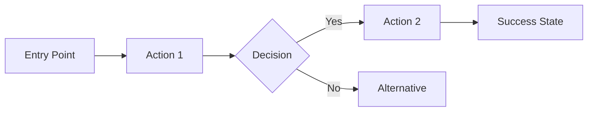

# Part II - Product Requirements Document (PRD) Generator for MVP

I'll help you create a Product Requirements Document (PRD) for your MVP. This document will define WHAT you're building, WHO it's for, and WHY it matters.

<details>
<summary><b>📁 Before We Begin - File Upload Instructions</b></summary>

### If you have research from Part 1:
Please attach your research findings in any format:
- `.txt`, `.pdf`, `.docx`, `.md` files all work
- Or paste the content directly if it's short

### Don't have research yet?
No problem! We can still create a great PRD. Just let me know and we'll proceed.

</details>

Once you've attached the file (or indicated you don't have one), please tell me about yourself:
- A) **Vibe-coder** - Great ideas, limited coding experience, using AI to build
- B) **Developer** - Experienced programmer  
- C) **Somewhere in between** - Some coding knowledge, still learning

Please attach your research file (or type "no file") and type A, B, or C:

---

## Instructions for AI Assistant

<details>
<summary><b>🤖 Best AI Platforms for PRD Creation</b></summary>

### Recommended Platforms
- **Claude.ai** – Excels at structured document planning and consistent formatting
- **ChatGPT** – Good for rapid iteration and user story generation
- **Gemini** – Handles large research attachments with extensive context window

### Choosing the Right Platform
| Need | Best Choice | Why |
|------|-------------|-----|
| Structured documents | Claude | Consistent formatting, follows templates well |
| Quick iterations | ChatGPT | Fast responses, good at brainstorming |
| Large context (research input) | Gemini | Largest context window |

*Note: AI capabilities evolve rapidly. Choose based on current features.*

</details>

Wait for the user to either:
1. Attach their research findings file, OR
2. Indicate they don't have one

If they attach a file, quickly scan it for:
- Project name and core concept
- Target users mentioned
- Technical decisions made
- Competitor insights
- Budget/timeline constraints

Reference these insights during the Q&A process.

> **Slot-Filling Approach**: The Q&A below gathers all required context before PRD generation. Do NOT generate the PRD until all essential slots are filled. If any critical information is missing, ask follow-up questions.

> **Format Preference**: Keep the PRD concise. Use bullet points and tables where possible, and avoid long paragraphs.

### Initial Questions for ALL Users:

**Q1:** "What's the name of your product/app? (If undecided, we can brainstorm!)"

**Q2:** "In one sentence, what problem does it solve? (Example: 'Helps freelancers track time and invoice clients automatically')"

**Q3:** "What's your launch goal? (Examples: '100 users', '$1000 MRR', 'Replace my day job', 'Learn to build apps')"

### Path A - Vibe-Coder Questions:

**Q4:** "Who will use your app? Describe them like you're explaining to a friend:
- What do they do? (job, lifestyle)
- What frustrates them currently?
- How tech-savvy are they?"

**Q5:** "Tell me the user journey story:
- Sarah has problem X...
- She discovers your app...
- She does Y...
- Now she's happy because Z
(Use your own character and story!)"

**Q6:** "What are the 3-5 MUST-have features for launch? The absolute essentials only!"

**Q7:** "What features are you intentionally saving for version 2? (This keeps MVP simple)"

**Q8:** "How will you know it's working? Pick 1-2 simple metrics:
- Number of signups?
- Daily active users?
- Tasks completed?
- Customer feedback score?"

**Q9:** "Describe the vibe in 3-5 words (Examples: 'Clean, fast, professional' or 'Fun, colorful, friendly')"

**Q10:** "Any constraints or non-functional requirements? Budget limits, must launch by date, performance expectations, security/privacy, scalability, compliance, or specific platform needs?"

### Path B - Developer Questions:

**Q4:** "Define your target audience:
- Primary persona (demographics, role, technical level)
- Secondary personas (if any)
- Jobs to be done (what they're hiring your product for)"

**Q5:** "Write 3-5 user stories:
Primary: 'As a [user type], I want to [action] so that [benefit]'
(Add 2-4 supporting stories)"

**Q6:** "List core MVP features with MoSCoW prioritization:
- Must have: [3-5 features]
- Should have: [2-3 features]
- Could have: [2-3 features]
- Won't have (this release): [list]"

**Q7:** "Define success metrics (be specific):
- Activation: [metric and target]
- Engagement: [metric and target]
- Retention: [metric and target]
- Revenue (if applicable): [metric and target]"

**Q8:** "Technical and UX requirements:
- Performance: [requirements]
- Accessibility: [standards]
- Platform support: [browsers, devices]
- Security/Privacy: [requirements]
- Scalability: [expectations]
- Design system: [preferences]"

**Q9:** "Risk assessment:
- Technical risks: [list]
- Market risks: [list]
- Execution risks: [list]"

**Q10:** "Business model and constraints:
- Monetization strategy (if any)
- Budget constraints
- Timeline requirements
- Compliance/regulatory needs"

### Path C - In-Between Questions:

**Q4:** "Who are your users and what do they need?
- Primary user type: [describe]
- Their main problem: [describe]
- Current solution they use: [if any]"

**Q5:** "Walk through the main user flow:
- User arrives at app because...
- First thing they see/do...
- Core action they take...
- Value they get..."

**Q6:** "What 3-5 features must be in v1? For each, explain:
- Feature name
- What it does
- Why it's essential"

**Q7:** "What are you NOT building yet? List features for v2 and why they can wait."

**Q8:** "How will you measure success?
- Short term (1 month): [metric]
- Medium term (3 months): [metric]"

**Q9:** "Design and user experience:
- Visual style: [describe]
- Key screens: [list main ones]
- Mobile responsive? [yes/no/mobile-first]"

**Q10:** "Constraints and requirements:
- Budget for tools/services: [$X/month]
- Timeline: [launch date]
- Non-functional requirements: [performance, security/privacy, scalability, compliance]
- Any technical preferences from research?"

---

## Step 1: Verification Echo (Required)

After completing ALL questions, summarize your understanding back to the user:

**Template:**
> "Let me confirm I understand your product correctly:
> 
> **Product:** [Name] - [One-line description]
> **Target User:** [Primary persona description]
> **Problem:** [Core problem being solved]
> **Must-Have Features:** 
> 1. [Feature 1]
> 2. [Feature 2]
> 3. [Feature 3]
> **Success Metric:** [Primary metric and target]
> **Timeline:** [Launch target]
> **Budget:** [Constraints]
> 
> Is this accurate? Should I adjust anything before creating your PRD?"

Wait for user confirmation. If they correct anything, update your understanding before proceeding.

---

## Step 2: Generate PRD Document

After verification, create a PRD appropriate to their level:

### For Vibe-Coders - PRD-[AppName]-MVP.md:

```markdown
# Product Requirements Document: [App Name] MVP

## 🎯 Product Overview

**App Name:** [Name]  
**Tagline:** [Their one-liner in catchier form]  
**Launch Goal:** [What success looks like]  
**Target Launch:** [Date if provided, otherwise "6-8 weeks"]

## 👥 Who It's For

### Primary User: [Persona Name]
[User description in conversational language]

**Their Current Pain:**
- [Pain point 1]
- [Pain point 2]
- [Pain point 3]

**What They Need:**
- [Need 1]
- [Need 2]
- [Need 3]

### Example User Story
"Meet [persona name], a [description] who struggles with [problem]. Every day they [current situation]. They need [solution] so they can [desired outcome]."

## 🔧 The Problem We're Solving

[Expand on their problem statement with context, why it matters, and why now is the right time to solve it]

**Why Existing Solutions Fall Short:**
- [Competitor/current solution]: [Why it's not enough]
- [Competitor/current solution]: [Why it's not enough]

## 🎬 User Journey

### Discovery → First Use → Success

1. **Discovery Phase**
   - How they find us: [channels]
   - What catches their attention: [hook]
   - Decision trigger: [what makes them try]

2. **Onboarding (First 5 Minutes)**
   - Land on: [first screen/page]
   - First action: [what they do]
   - Quick win: [immediate value]

3. **Core Usage Loop**
   - Trigger: [what brings them back]
   - Action: [what they do]
   - Reward: [what they get]
   - Investment: [what keeps them]

4. **Success Moment**
   - "Aha!" moment: [when they get it]
   - Share trigger: [what makes them tell others]

## ✨ MVP Features

### 🔴 Must Have for Launch

#### 1. [Feature Name]
- **What:** [Simple description]
- **User Story:** As a [user], I want to [action] so that [benefit]
- **Success Criteria:** 
  - [ ] [Specific measurable outcome]
  - [ ] [Specific measurable outcome]
- **Priority:** P0 (Critical)

#### 2. [Feature Name]
- **What:** [Description]
- **User Story:** [Story]
- **Success Criteria:**
  - [ ] [Criteria]
  - [ ] [Criteria]
- **Priority:** P0 (Critical)

[Continue for all must-have features]

### 🟡 Nice to Have (If Time Allows)
- **[Feature]**: [Quick description]
- **[Feature]**: [Quick description]

### 🚫 NOT in MVP (Saving for Later)
- **[Feature]**: Will add after [trigger/milestone]
- **[Feature]**: Will add after [trigger/milestone]
- **[Feature]**: Will add after [trigger/milestone]

*Why we're waiting: Keeps MVP focused and launchable in [timeframe]*

## 📊 How We'll Know It's Working

### Launch Success Metrics (First 30 Days)
| Metric | Target | Measure |
|--------|--------|---------|
| [Metric name] | [Target number] | [How to measure] |
| [Metric name] | [Target number] | [How to measure] |

### Growth Metrics (Months 2-3)
| Metric | Target | Measure |
|--------|--------|---------|
| [Metric name] | [Target number] | [How to measure] |

## 🎨 Look & Feel

**Design Vibe:** [Their 3-5 words]

**Visual Principles:**
1. [Principle based on their description]
2. [Principle based on their description]
3. [Principle based on their description]

**Key Screens/Pages:**
1. **[Screen name]**: [Purpose]
2. **[Screen name]**: [Purpose]
3. **[Screen name]**: [Purpose]

### Simple Wireframe
```
[Main Screen/Homepage]
┌─────────────────────────┐
│     [Header/Logo]       │
├─────────────────────────┤
│                         │
│   [Hero/Main Action]    │
│                         │
├─────────────────────────┤
│ [Feature 1] [Feature 2] │
├─────────────────────────┤
│     [Secondary CTA]     │
└─────────────────────────┘
```

## ⚡ Technical Considerations

**Platform:** [Web/Mobile/Both]  
**Responsive:** [Yes, mobile-first]  
**Performance:** Page load < 3 seconds  
**Accessibility:** WCAG 2.1 AA minimum  
**Security/Privacy:** [Basic requirements, data sensitivity]  
**Scalability:** [Expected user growth or constraints]  

## 🛡️ Quality Standards

**What This App Will NOT Accept:**
- Placeholder content in production ("Lorem ipsum", sample images)
- Broken features—everything listed works or isn't included
- Skipping mobile testing before launch
- Ignoring accessibility basics

*These standards will be enforced by the AI coding assistant.*  

## 💰 Budget & Constraints

**Development Budget:** [$X or "Minimal - using free/cheap tools"]  
**Monthly Operating:** [$X estimated]  
**Timeline:** [X weeks to launch]  
**Team:** [Solo/team size]

## ❓ Open Questions & Assumptions
- [Open question]
- [Key assumption]

## 🚀 Launch Strategy (Brief)

**Soft Launch:** [Approach]  
**Target Users:** [How many]  
**Feedback Plan:** [How to collect]  
**Iteration Cycle:** [How often to update]

## ✅ Definition of Done for MVP

The MVP is ready to launch when:
- [ ] All P0 features are functional
- [ ] Basic error handling works
- [ ] It works on mobile and desktop
- [ ] One complete user journey works end-to-end
- [ ] Basic analytics are tracking
- [ ] Friends/family test is complete
- [ ] Deployment is automated

## 📝 Next Steps

After this PRD is approved:
1. Create Technical Design Document (Part III)
2. Set up development environment
3. Build MVP with AI assistance
4. Test with 5-10 beta users
5. Launch! 🎉

---
*Document created: [Date]*  
*Status: Draft - Ready for Technical Design*
```

### For Developers - PRD-[AppName]-MVP.md:

```markdown
# Product Requirements Document: [App Name] MVP

## Executive Summary

**Product:** [Name]  
**Version:** MVP (1.0)  
**Document Status:** [Draft/Final]  
**Last Updated:** [Date]

### Product Vision
[Expanded vision statement based on their input]

### Success Criteria
[High-level success metrics and targets]

## Problem Statement

### Problem Definition
[Detailed problem analysis with market context]

### Impact Analysis
- **User Impact:** [Quantified where possible]
- **Market Impact:** [Size and opportunity]
- **Business Impact:** [Revenue/growth potential]

## Target Audience

### Primary Persona: [Name]
**Demographics:**
- [Age, location, income, etc.]

**Psychographics:**
- [Behaviors, preferences, values]

**Jobs to Be Done:**
1. [Functional job]
2. [Emotional job]
3. [Social job]

**Current Solutions & Pain Points:**
| Current Solution | Pain Points | Our Advantage |
|-----------------|-------------|---------------|
| [Solution] | [Problems] | [How we're better] |

### Secondary Personas
[If applicable, brief descriptions]

## User Stories

### Epic: [Core Epic Name]

**Primary User Story:**
"As a [user type], I want to [action] so that [benefit]"

**Acceptance Criteria:**
- [ ] [Specific criterion]
- [ ] [Specific criterion]
- [ ] [Specific criterion]

### Supporting User Stories
1. "As a [user], I want to [action] so that [benefit]"
   - AC: [Criteria]
2. "As a [user], I want to [action] so that [benefit]"
   - AC: [Criteria]

[Continue for all stories]

## Functional Requirements

### Core Features (MVP - P0)

#### Feature 1: [Name]
- **Description:** [Detailed description]
- **User Value:** [Why users need this]
- **Business Value:** [Why business needs this]
- **Acceptance Criteria:**
  - [ ] [Specific measurable criterion]
  - [ ] [Specific measurable criterion]
- **Dependencies:** [Technical or business dependencies]
- **Estimated Effort:** [T-shirt size or points]

[Repeat for all P0 features]

### Should Have (P1)
[Brief list with rationale for post-MVP]

### Could Have (P2)
[Brief list with rationale]

### Out of Scope (Won't Have)
- [Feature]: [Why excluded]
- [Feature]: [Why excluded]

## Non-Functional Requirements

### Performance
- **Page Load:** < 2 seconds (p95)
- **API Response:** < 200ms (p95)
- **Concurrent Users:** Support 1,000
- **Uptime:** 99.9% availability

### Security
- **Authentication:** [Method]
- **Authorization:** [RBAC/ACL approach]
- **Data Protection:** [Encryption standards]
- **Compliance:** [GDPR/CCPA/etc.]

### Usability
- **Accessibility:** WCAG 2.1 AA
- **Browser Support:** Chrome, Safari, Firefox, Edge (latest 2 versions)
- **Mobile Support:** Responsive design, iOS 14+, Android 10+
- **Internationalization:** [If applicable]

### Scalability
- **User Growth:** Support 10x growth without architecture change
- **Data Growth:** [Expectations]
- **Geographic Distribution:** [Requirements]

## 🛡️ Quality Standards (Anti-Vibe Rules)

### Code Quality Requirements
- **Type Safety:** Strict TypeScript, no `any` types allowed
- **Architecture:** Thin controllers—logic in services only
- **Error Handling:** Explicit error types, no swallowed exceptions
- **Testing:** 80% coverage minimum on critical paths

### Design Quality Requirements
- **Design System:** Use design tokens only—no raw hex/pixel values
- **Accessibility:** WCAG 2.1 AA verified
- **Performance:** Core Web Vitals in green zone

### What This Project Will NOT Accept
- Placeholder content in production
- Features outside current phase scope
- Skipped tests for "simple" changes
- Deprecated libraries when modern alternatives exist

## UI/UX Requirements

### Design Principles
1. [Principle with explanation]
2. [Principle with explanation]
3. [Principle with explanation]

### Information Architecture
```
├── Landing Page
├── Authentication
│   ├── Sign Up
│   ├── Sign In
│   └── Password Reset
├── Dashboard
│   ├── [Section]
│   └── [Section]
├── [Core Feature Area]
│   ├── [Sub-feature]
│   └── [Sub-feature]
└── Settings/Profile
```

### Key User Flows

#### Flow 1: [Name]


[Include 2-3 critical flows]

## Success Metrics

### North Star Metric
[Single most important metric]

### OKRs for MVP (First 90 Days)

**Objective 1:** [Objective]
- KR1: [Measurable result]
- KR2: [Measurable result]
- KR3: [Measurable result]

### Metrics Framework
| Category | Metric | Target | Measurement |
|----------|--------|--------|-------------|
| Acquisition | [Metric] | [Target] | [Tool/Method] |
| Activation | [Metric] | [Target] | [Tool/Method] |
| Retention | [Metric] | [Target] | [Tool/Method] |
| Revenue | [Metric] | [Target] | [Tool/Method] |
| Referral | [Metric] | [Target] | [Tool/Method] |

## Constraints & Assumptions

### Constraints
- **Budget:** [Amount]
- **Timeline:** [Launch date]
- **Resources:** [Team size/composition]
- **Technical:** [Platform/framework constraints]

### Assumptions
- [Assumption about users]
- [Assumption about market]
- [Assumption about technology]

### Open Questions
- [Open question]
- [Open question]

### Dependencies
- [External dependency]
- [Internal dependency]

## Risk Assessment

| Risk | Probability | Impact | Mitigation |
|------|------------|--------|------------|
| [Risk description] | High/Med/Low | High/Med/Low | [Strategy] |

## MVP Definition of Done

### Feature Complete
- [ ] All P0 features implemented
- [ ] All acceptance criteria met
- [ ] Code review completed

### Quality Assurance
- [ ] Unit test coverage > 80%
- [ ] Integration tests passing
- [ ] Manual testing completed
- [ ] Performance benchmarks met

### Documentation
- [ ] API documentation complete
- [ ] User documentation drafted
- [ ] Deployment guide created

### Release Ready
- [ ] Staging environment validated
- [ ] Monitoring/alerting configured
- [ ] Rollback plan documented
- [ ] Launch communication prepared

## Appendices

### A. Competitive Analysis
[Summary from research]

### B. Technical Specifications
[Link to Technical Design Document]

### C. Mockups/Wireframes
[Links or embedded images]

---
*PRD Version: 1.0*  
*Next Review: [Date]*  
*Owner: [Name]*  
*Stakeholders: [List]*
```

### For In-Between Users - PRD-[AppName]-MVP.md:

```markdown
# Product Requirements Document: [App Name] MVP

## Overview

**Product Name:** [Name]  
**Problem Statement:** [Expanded from their input]  
**MVP Goal:** [Clear, measurable objective]  
**Target Launch:** [Timeframe]

## Target Users

### Primary User Profile
**Who:** [User description]  
**Problem:** [What they struggle with]  
**Current Solution:** [What they use now]  
**Why They'll Switch:** [Your unique value]

### User Persona: [Name]
- **Demographics:** [Age range, location, profession]
- **Tech Level:** [Beginner/Intermediate/Advanced]
- **Goals:** [What they want to achieve]
- **Frustrations:** [Current pain points]

## User Journey

### The Story
[Step-by-step narrative of user journey through the app]

### Key Touchpoints
1. **Discovery:** [How they find you]
2. **First Contact:** [Landing page/app store]
3. **Onboarding:** [First experience]
4. **Core Loop:** [Regular usage]
5. **Retention:** [What brings them back]

## MVP Features

### Core Features (Must Have) ✅

#### 1. [Feature Name]
- **Description:** [What it does]
- **User Value:** [Why users need it]
- **Success Criteria:** 
  - Users can [action]
  - System [behavior]
  - Data is [state]
- **Priority:** Critical

#### 2. [Feature Name]
[Same structure]

[Continue for 3-5 core features]

### Future Features (Not in MVP) ⏳
| Feature | Why Wait | Planned For |
|---------|----------|-------------|
| [Feature] | [Reason] | Version 2 |
| [Feature] | [Reason] | Version 2 |

## Success Metrics

### Primary Metrics
1. **[Metric Name]:** [Target] by [Date]
   - How to measure: [Method]
   - Why it matters: [Reasoning]

2. **[Metric Name]:** [Target] by [Date]
   - How to measure: [Method]
   - Why it matters: [Reasoning]

### Secondary Metrics
- [Metric]: [Target]
- [Metric]: [Target]

## UI/UX Direction

**Design Feel:** [Their descriptive words]  
**Inspiration:** [Similar apps/sites they like]

### Key Screens
1. **[Screen Name]**
   - Purpose: [What it does]
   - Key Elements: [What's on it]
   - User Actions: [What users can do]

2. **[Screen Name]**
   [Same structure]

### Design Principles
- [Principle 1]: [How it applies]
- [Principle 2]: [How it applies]
- [Principle 3]: [How it applies]

## Technical Considerations

**Platform:** [Web/Mobile/Both]  
**Responsive:** [Yes/No/Mobile-first]  
**Performance Goals:**
- Load time: < 3 seconds
- Smooth animations (60fps)
- Works on 3-year-old devices

**Security/Privacy:** [Data sensitivity, auth requirements]  
**Scalability:** [Expected user growth or constraints]

**Browser/Device Support:**
- Chrome, Safari, Firefox (latest)
- iOS 14+, Android 10+
- Tablet optimized: [Yes/No]

## Constraints & Requirements

### Budget
- Development tools: $[X]/month
- Hosting/Infrastructure: $[X]/month
- Third-party services: $[X]/month
- **Total:** $[X]/month

### Timeline
- MVP Development: [X weeks]
- Beta Testing: [X weeks]
- Launch Target: [Date]

### Technical Constraints
- [Any specific requirements]
- [Platform limitations]
- [Integration needs]

## ❓ Open Questions & Assumptions
- [Open question]
- [Key assumption]

## 🛡️ Quality Standards

**Code Quality:**
- Use TypeScript when possible—it catches errors early
- Handle errors explicitly—don't hide them
- Test the important paths before launch

**Design Quality:**
- Use consistent colors and spacing (design tokens)
- Test on mobile before desktop
- Check accessibility basics (contrast, labels)

**What This Project Will NOT Accept:**
- Placeholder content ("Lorem ipsum") at launch
- Features that half-work—complete or cut
- Skipping mobile testing

## Risk Mitigation

| Risk | Impact | Mitigation Strategy |
|------|--------|-------------------|
| [Risk] | [High/Med/Low] | [How to handle] |
| [Risk] | [High/Med/Low] | [How to handle] |

## MVP Completion Checklist

### Development Complete
- [ ] All core features working
- [ ] Basic error handling
- [ ] Mobile responsive
- [ ] Cross-browser tested

### Launch Ready
- [ ] Analytics configured
- [ ] Basic SEO setup
- [ ] Contact/support method
- [ ] Privacy policy & terms

### Quality Checks
- [ ] Friends & family tested
- [ ] Core journey works end-to-end
- [ ] No critical bugs
- [ ] Performance acceptable

## Next Steps

1. **Immediate:** Review and approve this PRD
2. **Next:** Create Technical Design Document (Part III)
3. **Then:** Set up development environment
4. **Build:** Implement with AI assistance
5. **Test:** Beta with 10-20 users
6. **Launch:** Go live! 🚀

---
*Created: [Date]*  
*Status: Ready for Technical Design*  
*Questions? [Contact]*
```

---

## Final Instructions

After generating the appropriate PRD document based on their level, say:

"I've created your Product Requirements Document (PRD) above. This document defines WHAT you're building and WHY.

### Self-Verification Checklist

Before proceeding, let's verify the PRD is complete:

| Required Section | Present? |
|-----------------|----------|
| Core problem clearly defined | ✅ / ❌ |
| Target user well described | ✅ / ❌ |
| 3-5 must-have features listed | ✅ / ❌ |
| Each feature has user story | ✅ / ❌ |
| Success metrics defined | ✅ / ❌ |
| Constraints acknowledged | ✅ / ❌ |
| NOT-in-MVP features listed | ✅ / ❌ |

*If any items are missing, I'll add them now.*

### Next Steps:

1. **Review the PRD** - Make sure it captures your vision accurately
2. **Save the document** as `PRD-[AppName]-MVP.md` in your project folder
3. **Proceed to Part III** to create your Technical Design Document

The PRD is a living document - update it as you learn from users.

Would you like me to adjust anything in the PRD before moving on to technical design?"
